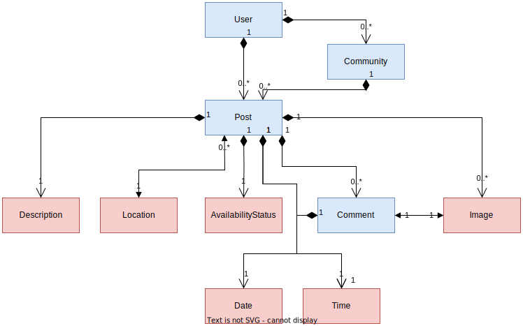

# Tasty Trails: A Community Food Sharing Platform

## Project Overview

Welcome to Tasty Trails, a purpose-driven web application designed to foster community collaboration and reduce food waste. Tasty Trails provides a platform for users to share information about surplus food, creating a better environment where everyone can contribute to minimizing food wastage. 

For users, Tasty Trails means more than just access to surplus food; it's an opportunity to discover and enjoy delicious meals while promoting sustainability in the community. Our primary goal is to target those in need, ensuring that both food providers and recipients find mutual benefit through this platform. By connecting surplus food providers with those facing food insecurity, Tasty Trails strives to create a space where every shared meal makes a meaningful impact on individuals and communities.

## Key Features

### 🌱 **Surplus Food Management**

- **Create, Read, Update, Delete (CRUD) Operations:**
  Users can seamlessly create, browse, edit, and delete posts about surplus food items.

### 🗺️ **Intuitive User Experience**

- **Multiple UI Routes:**
  Tasty Trails offers efficient routing for separate pages like the home feed, community feed, user profile, and detailed post views.

- **Redux State Management:**
  A smooth and responsive user interface is ensured through Redux, efficiently managing application state for users.

- **Internationalization:**
  Tasty Trails speaks your language! Enjoy the application in multiple languages for a global, inclusive experience.

### 🍽️ **Professional UI Design**

- **Clean and User-Friendly Interface:**
  Tasty Trails boasts a professional and inviting design, promoting easy navigation and an enjoyable user experience.

### 🚀 **Robust Backend Infrastructure**

- **RESTful API Backend:**
  The backend, powered by Node.js and MongoDB, delivers seamless CRUD operations, ensuring efficient data management.

- **Domain Driven Design:**
  Organized backend code follows domain-driven design principles, enhancing maintainability and scalability.

### 🌐 **Community Engagement**

- **Comment Section for Each Post:**
  Encourage community interaction through dedicated comment sections for each post, fostering a sense of shared responsibility.

### 🎉 **Additional Features**

- **Search Functionality:**
  Easily find specific food items or explore posts.

- **User Authentication:**
  Secure your account and personalize your Tasty Trails experience with user authentication.

## Object Model Diagram

## Tech Stack

- **Frontend (UI):**
  - SCSS
  - React
  - Node.js
  - Typescript
  - Redux
  - Internationalization (i18n)

- **Backend:**
  - Node.js
  - Express.js
  - MongoDB

Let's create a world where every meal shared is a step towards a more sustainable future! 🌍🍲
